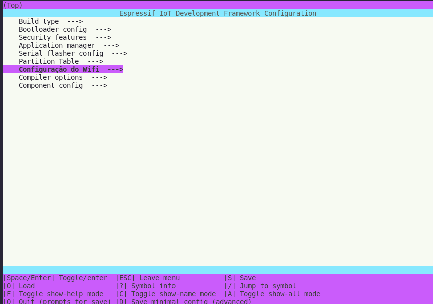
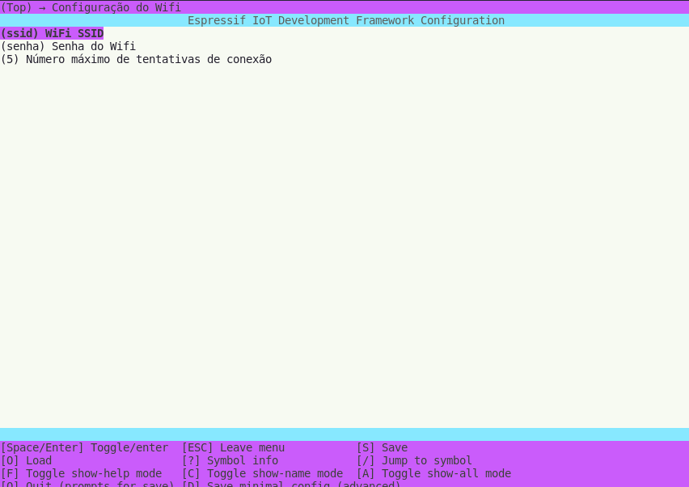
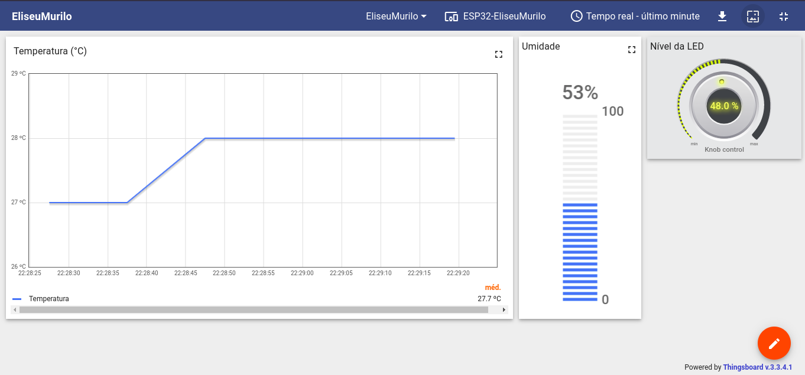

# FSE - Trabalho Final

Enunciado: https://gitlab.com/fse_fga/trabalhos-2022_2/trabalho-final-2022-2
Vídeo: https://www.youtube.com/watch?v=dM8EovTHQ7o

IDE Utilizada: Espress-if via VSCode

## Alunos:
* Murilo Gomes
* Eliseu Kadesh

## Configurando o Wifi

Para configurar o wi-fi, basta rodar o comando e alterar a configuração do Wifi

```bash
idf.py menuconfig
```





## Dashboard
Nome -> EliseuMurilo


